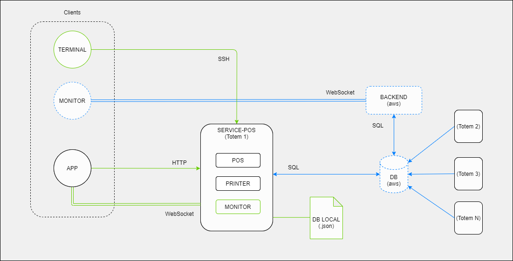

# Service POS

Micro servicio para controlar y monitorear el POS y la impresora del totem digital.

## Diagrama de Diseño

## Endpoints Server HTTP

| Metodo | Endpoint | Body        | Descripción                                  |
| ------ | -------- | ----------- | -------------------------------------------- |
| POST   | /newSale | TSale[body] | Ejecutar un nuevo proceso de venta en el POS |

> TODO: falta por crear endpoints

Los datos a enviar en cada petición estan documentados en los siguientes tipos de typescript:
[serverHTTP.d.ts](./src/@types/serverHTTP.d.ts)

## Endpoints Server Web Socket

> TODO: falta por crear endpoints
